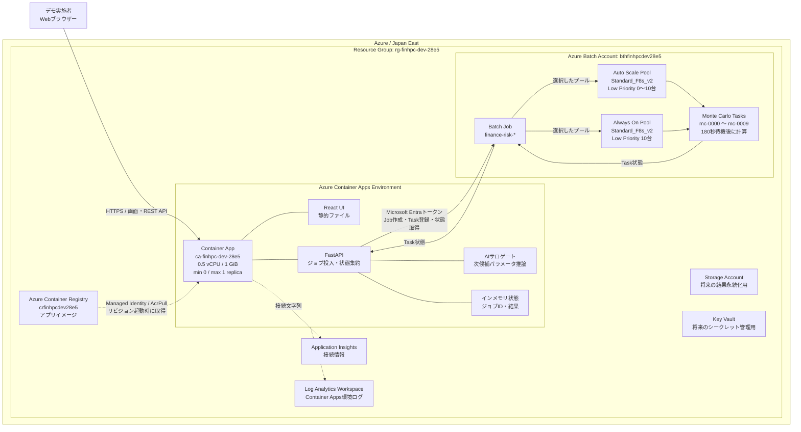
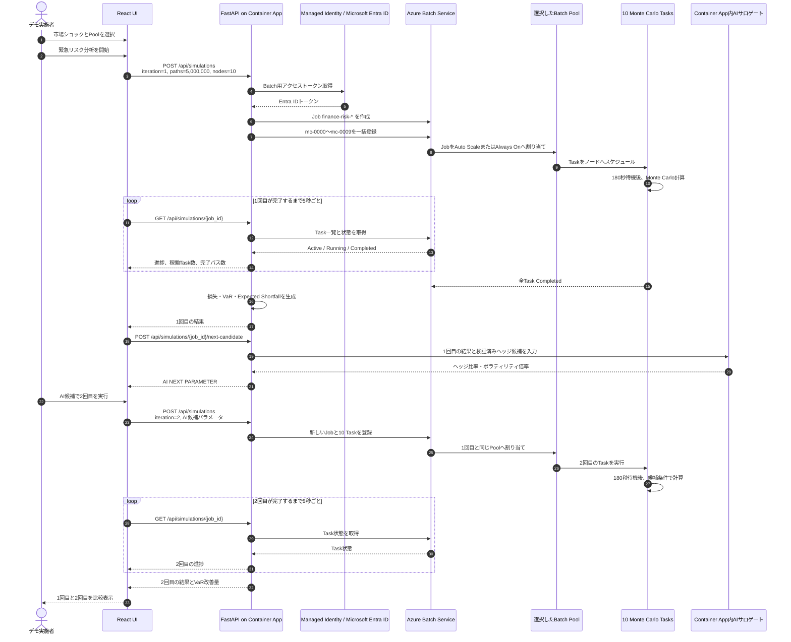

# Azure Finance HPC Demo

金融市場ショックを題材に、Azure BatchによるMonte Carlo並列計算と、AIサロゲートモデルによる次候補の推論・再計算を可視化するライブデモです。

公開デモ画面:

<https://ca-finhpc-dev-28e5.graydesert-bcea4ea3.japaneast.azurecontainerapps.io>

> このアプリケーションが表示する数値はデモデータです。実際の投資判断や取引には利用しないでください。

## このデモで伝えたいこと

金融機関では、市場が急変したときに次のような計算が必要になります。

1. 現在のポートフォリオにどれくらい損失が発生するかを計算する
2. VaRやExpected Shortfallなどのリスク指標を確認する
3. 損失を抑えるヘッジ候補を探索する
4. 候補をより精密なシミュレーションで再検証する
5. 市場環境が変わる前に意思決定する

手元の小規模な計算環境では、シナリオ数が増えるほど計算時間が長くなります。このデモでは、互いに独立したMonte Carlo計算をAzure Batchの複数ノードへ分散し、必要なときだけ計算能力を増やす流れを示します。

## 想定しているデモシナリオ

### 分析対象

- ポートフォリオ総額: 2.84兆円
- ポジション数: 100,000
- アセットクラス: 株式、金利、為替、クレジット
- Monte Carloパス数: 5,000,000
- Azure Batchノード: `Standard_F8s_v2` Low Priority、デフォルト10ノード

### 推奨シナリオ: 複合市場ショック

イベント本番では、最初に「複合市場ショック」を選ぶことを推奨します。

- 株式: -12%
- 金利: +150 bp
- 複数のリスク要因が同時に悪化
- ポートフォリオの想定損失、99% VaR、Expected Shortfallを評価

説明例:

> 大きな市場ショックが発生し、経営層から数分以内に損失額と対策案を求められた状況を想定します。最初のAzure Batch計算で現在のリスクを把握し、その結果からAIが次のヘッジ候補を推論します。続いて同じAzure Batch基盤へ2回目のジョブを投入し、候補が本当に損失を抑えられるかを精密計算で確認します。

ほかに次のシナリオも選択できます。

| シナリオ | 想定状況 | デモでの見せ方 |
|---|---|---|
| 複合市場ショック | 株式下落と金利上昇が同時発生 | 複数リスク要因をHPCで一括評価する標準シナリオ |
| 急激な円高 | USD/JPYが急落し、相関も上昇 | 為替ヘッジの必要性を説明するシナリオ |
| 金利急騰 | イールドカーブが大きく上方シフト | 債券・金利ポジションのデュレーションリスクを説明するシナリオ |

## デモの全体フロー

```text
市場ショックを選択
        |
        v
1回目のAzure Batchジョブ
  5,000,000パス / 10ノード
        |
        v
損失・VaR・Expected Shortfallを表示
        |
        v
AIサロゲートが次候補を推論
  - ヘッジ比率
  - ボラティリティ倍率
        |
        v
2回目のAzure Batchジョブ
        |
        v
1回目と2回目のVaRを比較
        |
        v
Auto Scaleは0ノードへ縮退
Always Onは10ノードを維持
```

AI部分は、イベントでの再現性を優先した決定論的サロゲートモデルです。外部の生成AIサービスは呼び出していません。1回目のExpected ShortfallとHPC検証済みヘッジ候補から、2回目に使うヘッジ比率とボラティリティ倍率を推論します。

## Azure構成

### システム全体構成図

以下は、BicepでJapan Eastのリソースグループ`rg-finhpc-dev-28e5`へ展開する構成です。実線はデモ実行時の主な通信、破線はデプロイまたは監視の経路を表します。



### 各Azureサービスの役割

| Azureサービス | 役割 |
|---|---|
| Azure Container Apps | React画面とFastAPIを1つのコンテナで実行し、Batchジョブの投入、状態取得、AI候補推論、結果表示を統括 |
| Azure Container Registry | ビルド済みコンテナイメージを保存。Container Appのシステム割り当てマネージドIDに`AcrPull`を付与 |
| Azure Batch Account | Monte Carloジョブと10個のタスクを管理し、選択されたプールへ割り当て |
| Auto Scale Pool | `Standard_F8s_v2` Low Priorityを保留タスク数に応じて0～10ノードへ増減。評価間隔は5分 |
| Always On Pool | `Standard_F8s_v2` Low Priorityを10ノード固定で確保し、ノード起動待ちを減らすデモ用プール |
| Azure Storage | 将来、入力データ、Task出力、結果を永続化するために確保。現在のデモ実行経路では未使用 |
| Azure Key Vault | 将来のシークレット管理用に確保。現在のBatch認証はシークレットではなくマネージドIDを使用 |
| Application Insights | 接続文字列をContainer Appへ設定。アプリケーション監視を拡張するための基盤 |
| Log Analytics | Container Apps Environmentに接続し、コンテナと環境のログを集中管理 |

### Container App内部の役割

Container App `ca-finhpc-dev-28e5`では、1つのコンテナ内で次の処理を実行します。

1. **React UIの配信**: FastAPIの静的ファイルとしてビルド済み画面を返します。
2. **シミュレーションAPI**: `POST /api/simulations`で実行要求を受け付けます。
3. **Batchオーケストレーション**: Batch Jobを作成し、目標ノード数に合わせて最大10個の`mc-*` Taskを登録します。
4. **状態集約**: ブラウザーから5秒ごとに呼ばれる`GET /api/simulations/{job_id}`を契機に、BatchのTask状態を取得して進捗へ変換します。
5. **AI候補推論**: 1回目の完了結果から、2回目に使うヘッジ比率とボラティリティ倍率を決定します。外部AIサービスは呼び出しません。
6. **結果生成**: 全Taskの完了後、デモ用の損失、VaR、Expected Shortfall、ヘッジ候補を生成して画面へ返します。

Container AppはSingle Revision、外部HTTPS Ingress、ポート8000で動作します。課金を抑えるため通常は`minReplicas: 0`、`maxReplicas: 1`です。Gunicornも1ワーカーで動作し、ジョブ対応表をメモリ上に保持します。このため、**シミュレーション実行中にページを再読み込みしたり、Container Appのリビジョンを更新したりしないでください**。

### Azure Batch内部の役割

1回のシミュレーション要求では、Container Appが`finance-risk-*`というBatch Jobを1つ作成します。デフォルトの`target_nodes`は10なので、Jobには`mc-0000`から`mc-0009`までの10 Taskが登録されます。

各TaskはLinuxノード上で次の順に動作します。

1. `BATCH_TASK_DELAY_SECONDS=180`の設定に従い、デモで実行中の状態を見せるため180秒待機
2. Taskごとに異なる乱数シードでMonte Carloサンプルを生成
3. 平均値と下方1%の平均値を計算
4. JSONをTaskの標準出力へ書き込み、Taskを完了

デモでは、シナリオとヘッジ条件を全Taskで共有し、乱数シードと担当パスを分割します。10ノードを指定した場合でも、Batchスケジューラーが実際のTask配置を決めるため、「1 Taskが必ず1台の専用ノードを占有する」という意味ではありません。

プールは画面から次のどちらかを選択します。

| プール | ノード設定 | 向いている場面 | 注意点 |
|---|---:|---|---|
| Auto Scale | Low Priority 0～10台 | 通常運用、デモ後の費用を抑えたい場合 | 5分の評価間隔とVM起動時間が加わる |
| Always On | Low Priority 10台固定 | 登壇デモで約3分の計算をすぐ開始したい場合 | アイドル中も料金と80コアのクォータを消費する |

### 2段階シミュレーションの動作シーケンス



### 認証とアクセス制御

Container AppからAzure Batchへの接続には、共有キーではなくマネージドIDとMicrosoft Entra IDを利用します。

- Container Appのシステム割り当てマネージドIDに、Batch Accountスコープの`Azure Batch Data Contributor`を付与
- 同じマネージドIDに、Container Registryスコープの`AcrPull`を付与
- Batch SDKは`DefaultAzureCredential`で`https://batch.core.windows.net/.default`のトークンを取得
- Batch AccountはAAD認証のみを許可し、アプリコードや環境変数へ共有キーを保存しない
- Key Vaultに対する`Key Vault Secrets Officer`はデプロイ実施者へ付与され、Container AppのBatch実行には使用しない

### 現在のデモ実装でのデータ集約

現在の実装では、Batch Taskが出力したJSONをContainer Appへ回収・集約してリスク値を算出するのではなく、Container Appが**全Taskの完了状態を確認した後**、同じシナリオパラメータから再現性のあるデモ用指標を生成します。これによりライブデモを安定させています。

実運用へ発展させる場合は、各Taskの結果をAzure Storageへ保存し、集約TaskまたはContainer Appがそのデータを読み取ってVaRとExpected Shortfallを算出する構成に変更します。また、現在メモリ上にあるジョブ対応表もCosmos DBやTable Storageなどへ永続化する必要があります。

## Azure初心者向け: デモ開始前の準備

### Step 1: 必要なものを確認する

デモ実施者に必要なものは次のとおりです。

- インターネットへ接続できるPC
- 最新版のMicrosoft EdgeまたはGoogle Chrome
- 公開デモ画面のURL
- Azure Portalを見せる場合は対象サブスクリプションへのアクセス権
- CLIで確認する場合はAzure CLI

デモ画面自体には利用者認証を設定していないため、URLを開くだけで表示できます。URLの取り扱いには注意してください。

### Step 2: Azureへサインインする（CLIを使う場合）

Azure CLIを使わず、Azure Portalだけで確認しても構いません。CLIを使う場合は次を実行します。

```bash
az login

az account set \
  --subscription 02822f3b-51ae-46e7-b446-9d74b942e87c

az account show \
  --subscription 02822f3b-51ae-46e7-b446-9d74b942e87c \
  --query '{name:name,id:id,tenantId:tenantId}' \
  -o table
```

サブスクリプション名が `ME-MngEnvMCAP037207-hikurais-1` であることを確認します。

### Step 3: デモ画面が起動していることを確認する

ブラウザーで次のURLを開きます。

<https://ca-finhpc-dev-28e5.graydesert-bcea4ea3.japaneast.azurecontainerapps.io>

Container Appsは課金を抑えるため最小レプリカ数を0にしています。そのため、しばらくアクセスがない状態ではアプリが停止しており、最初のアクセス時にCold Start（コンテナの起動）が発生します。最初の表示には30～60秒程度かかる場合があり、ブラウザーや`curl`が先にタイムアウトすることがあります。表示されない場合は、30秒ほど待ってからページを再読み込みしてください。

CLIで確認する場合:

```bash
DEMO_URL="https://ca-finhpc-dev-28e5.graydesert-bcea4ea3.japaneast.azurecontainerapps.io"

curl --fail --location "$DEMO_URL/healthz"
curl --fail --location "$DEMO_URL/readyz"
```

それぞれ次のような応答が返れば準備完了です。

```json
{"status":"ok"}
```

```json
{"status":"ready"}
```

### Step 4: Container Appの状態を確認する

Azure Portalでは、次の順に開きます。

1. Azure Portalへサインイン
2. Resource groupsを開く
3. `rg-finhpc-dev-28e5`を選択
4. `ca-finhpc-dev-28e5`を選択
5. Overviewで状態とApplication URLを確認
6. Revision managementで最新リビジョンがActiveであることを確認

CLIで確認する場合:

```bash
az containerapp show \
  --subscription 02822f3b-51ae-46e7-b446-9d74b942e87c \
  --resource-group rg-finhpc-dev-28e5 \
  --name ca-finhpc-dev-28e5 \
  --query '{
    state:properties.provisioningState,
    revision:properties.latestReadyRevisionName,
    image:properties.template.containers[0].image,
    fqdn:properties.configuration.ingress.fqdn
  }' \
  -o json
```

`state`が`Succeeded`で、`revision`が空でなければ正常です。

### Step 5: Batchクォータとプールを確認する

このデモは`Standard_F8s_v2`（8コア）を使用します。画面のAzure Batch設定では、次の2つの実行モードを選択できます。

- **Auto Scale**: 従来どおり、計算ノード0台から開始し、保留タスクに応じて最大10台まで自動的に増減します。コストを抑えられますが、Azure Batchの自動スケール評価間隔（最短5分）とノード起動時間が発生します。
- **Always On**: 専用プールをLow Priority 10台で常時起動し、ジョブ投入後すぐに実行できるようにします。待ち時間を短縮できますが、アイドル中もノード料金が発生し、Low Priorityの容量・クォータを継続して使用します。

2つのプールを同時にデプロイする場合、Low Priorityコアは最大160（Auto Scale最大80 + Always On 80）必要です。現在の設定値150コアでは、Always Onプールを含む初回デプロイがクォータ不足になる可能性があります。必要に応じてクォータを増加するか、`infra/modules/batch.bicep`のノード数を調整してください。

```bash
az batch account show \
  --subscription 02822f3b-51ae-46e7-b446-9d74b942e87c \
  --resource-group rg-finhpc-dev-28e5 \
  --name bthfinhpcdev28e5 \
  --query '{
    state:provisioningState,
    lowPriorityCoreQuota:lowPriorityCoreQuota,
    poolQuota:poolQuota
  }' \
  -o table
```

次を確認します。

- `state`: `Succeeded`
- `lowPriorityCoreQuota`: 160以上（推奨申請値は200）
- `poolQuota`: 2以上

続いてプールを確認します。

```bash
POOL_ID="/subscriptions/02822f3b-51ae-46e7-b446-9d74b942e87c/resourceGroups/rg-finhpc-dev-28e5/providers/Microsoft.Batch/batchAccounts/bthfinhpcdev28e5/pools/pool-finhpc-dev-28e5"

az resource show \
  --subscription 02822f3b-51ae-46e7-b446-9d74b942e87c \
  --ids "$POOL_ID" \
  --api-version 2025-06-01 \
  --query '{
    state:properties.provisioningState,
    allocationState:properties.allocationState,
    vmSize:properties.vmSize,
    currentLowPriorityNodes:properties.currentLowPriorityNodes
  }' \
  -o table
```

デモ開始前は`currentLowPriorityNodes`が0でも正常です。ジョブ投入後に最大10ノードまで増加します。

### Step 6: 本番前に1回リハーサルする

イベントの前日または当日に、後述する本番手順を一度実施します。

確認ポイント:

- 最初の画面が表示される
- 実行先がAzure Batchになっている
- 1回目のジョブが完了する
- AI NEXT PARAMETERが表示される
- 2回目のジョブを投入できる
- 1回目と2回目のVaR比較が表示される
- 最後にBatchプールが0ノードへ戻る

リハーサル後は、画面の状態を残すためにブラウザーを開き続ける必要はありません。ジョブ実行中はページを再読み込みしないでください。

### Step 7: 会場で見せる画面を準備する

デモ開始の5～10分前に次を実施します。

1. デモURLを開いてコールドスタートを終わらせる
2. ブラウザーの表示倍率を会場スクリーンに合わせる
3. 通知やスクリーンセーバーを無効化する
4. デモ画面を1つ目のタブで開く
5. Azure PortalのBatch Pool画面を2つ目のタブで開く
6. Azure PortalのBatch Jobs画面を3つ目のタブで開く
7. 不要なタブや個人情報が表示される画面を閉じる

Azure Portalを併用すると、「画面上の進捗表示だけでなく、実際にAzure Batchへジョブが作成され、ノードが増えている」ことを見せられます。

## 当日のStep-by-Stepデモ手順

### Step 1: ストーリーを説明する

最初に次のように説明します。

> 市場が急変し、100,000ポジションを持つ2.84兆円のポートフォリオについて、損失額と対策を短時間で求められた場面です。500万パスのMonte Carlo計算をAzure Batchへ分散し、最初の分析結果からAIが次の候補を推論します。

### Step 2: 市場ショックを選択する

画面左側の「市場ショックを選択」で「複合市場ショック」を選択します。

説明ポイント:

- 株式下落と金利上昇が同時に起きる厳しいシナリオ
- 単一商品の価格計算ではなく、複数アセットを含むポートフォリオ分析
- 5,000,000パスを独立タスクへ分割できるため、並列計算との相性がよい

### Step 3: Azure Batchを選択する

「計算モード」で`Azure Batch`を選びます。

`Local Cluster`はAzure障害時や説明練習用のフォールバックです。AIによる2回目のAzure Batchジョブを見せる本番デモでは、必ず`Azure Batch`を選択してください。

画面上で次を確認します。

- Monte Carlo: 5,000,000
- 目標ノード: 10
- Azure Batch: 実リソースで実行

### Step 4: 1回目のシミュレーションを開始する

「緊急リスク分析を開始」をクリックします。

処理中はページを再読み込みしたり、ブラウザーを閉じたりしないでください。ジョブ状態はデモ用にメモリ上で管理しています。

状態は次の順に進みます。

1. キュー投入
2. HPCノード増強中
3. Monte Carlo実行中
4. AI提案を厳密検証中
5. 分析完了

デモ中に計算処理を確認できるよう、各Azure Batchタスクは計算前に意図的に180秒待機します。そのため、Always Onプールではジョブ投入や結果集計を含めて約3分強が目安です。

Auto Scaleプールが0ノードから起動する場合は、この約3分にVMの準備時間が加わり、最初のジョブには通常6～11分程度かかります。しばらく0%のままでも、AzureがVMを準備している間は正常です。

待ち時間にはAzure PortalのBatch画面を見せます。

1. `bthfinhpcdev28e5`を開く
2. Poolsで`pool-finhpc-dev-28e5`を選ぶ
3. Low-priority nodesが増える様子を確認する
4. Jobsで`finance-risk-`から始まるジョブを確認する
5. Tasksで10個のMonte Carloタスクを確認する

### Step 5: 1回目のリスク結果を説明する

分析完了後、次を順に説明します。

- 想定損失: ショック発生時の基準損失
- 99% VaR: 99%の確率で超えないと想定される損失水準
- Expected Shortfall: VaRを超える深刻なケースでの平均損失
- 損失寄与度: 株式、金利、為替、クレジットの影響割合
- AIヘッジ提案: 損失を抑える候補とHPCによる検証値

説明例:

> AIが候補を速く絞り込みますが、AIの予測値だけでは意思決定しません。候補をHPCの精密計算へ戻し、予測と検証値の誤差も確認します。

### Step 6: AIが推論した次候補を確認する

1回目のAzure Batchジョブが完了すると、`AI NEXT PARAMETER`カードが表示されます。

カードには次が表示されます。

- 選択したヘッジ戦略
- ヘッジ比率
- ボラティリティ倍率
- 2回目に使用するノード数
- AIによる予測損失
- その候補を選んだ理由

説明例:

> 1回目のExpected Shortfallと、HPCで検証したヘッジ候補を入力として、AIサロゲートが次に調べるべきパラメータを選びました。ここでは、単に結果を表示するだけでなく、計算結果から次の計算条件を作る閉ループになっています。

### Step 7: 2回目のAzure Batchジョブを投入する

「AI候補で2回目のAzure Batchを実行」をクリックします。

2回目もAzure Batchへ別のジョブとして投入され、1回目と同様に各タスクが約3分動作します。最初のジョブで起動したノードがまだ利用可能であれば、ノード準備を待たずに始まり、全体では約3分強が目安です。

ボタンを連続してクリックする必要はありません。ジョブ投入中はボタンが無効になります。

### Step 8: 1回目と2回目を比較する

2回目が完了すると、1回目と2回目のVaR比較が表示されます。

説明ポイント:

- AI候補を採用した場合にVaRがどう変化したか
- AI予測だけでなく、2回目もAzure Batchで再計算していること
- 「HPCで現状把握 → AIで探索 → HPCで再検証」という役割分担
- 必要なときだけ計算ノードを増やし、終了後は0へ戻すクラウドのコスト効率

検証時の一例では、VaRが101.7億円から58.6億円へ改善しました。値はデモ用であり、実行条件によって表示が多少変わる場合があります。

### Step 9: デモを締める

締めの説明例:

> Azure Batchを使うことで、大量の独立シミュレーションを必要なときだけ並列化できます。AIは次の候補探索を高速化し、最終判断に使う数値は再びHPCで検証します。計算後はノードが0へ戻るため、オンプレミスの最大需要に合わせて計算機を保有する必要もありません。

## トラブルシューティング

### 画面がすぐに表示されない

Container Appsが0レプリカから起動している可能性があります。30～60秒待ってから再度アクセスしてください。

### ジョブが0%から進まない

BatchがLow Priority VMを割り当てている可能性があります。最初の起動には数分かかります。

Azure Portalで次を確認します。

- Batch PoolのAllocation state
- Low-priority nodes
- Resize errors
- Batch JobsとTasksの状態

### AI NEXT PARAMETERが表示されない

次を確認します。

- `Local Cluster`ではなく`Azure Batch`を選んだか
- 1回目のジョブが「分析完了」になっているか
- 実行中にページを再読み込みしていないか

### ジョブが見つからないと表示される

Container Appが再起動すると、メモリ上のジョブ履歴が失われます。もう一度1回目から実行してください。本番システムへ発展させる場合は、ジョブ状態をCosmos DBなどへ永続化してください。

### Low Priorityノードが割り当てられない

Low Priority VMは余剰キャパシティを利用するため、利用可能性が保証されません。

1. Batchクォータが80コア以上あることを確認
2. PoolのResize errorsを確認
3. 数分待って再試行
4. イベント前に必ず同じ時刻帯でリハーサル

## デモ終了後に課金を抑える

### パターンA: 近日中に再利用する

環境を残して次回も使う場合は、Batchプールが0ノードへ戻ったことを必ず確認します。オートスケールの評価間隔は5分で、VMの削除完了までさらに数分かかることがあります。

```bash
POOL_ID="/subscriptions/02822f3b-51ae-46e7-b446-9d74b942e87c/resourceGroups/rg-finhpc-dev-28e5/providers/Microsoft.Batch/batchAccounts/bthfinhpcdev28e5/pools/pool-finhpc-dev-28e5"

az resource show \
  --subscription 02822f3b-51ae-46e7-b446-9d74b942e87c \
  --ids "$POOL_ID" \
  --api-version 2025-06-01 \
  --query '{
    allocationState:properties.allocationState,
    dedicatedNodes:properties.currentDedicatedNodes,
    lowPriorityNodes:properties.currentLowPriorityNodes
  }' \
  -o table
```

次の状態になるまで待ちます。

- `allocationState`: `Steady`
- `dedicatedNodes`: `0`
- `lowPriorityNodes`: `0`

Container Appsも最小レプリカ数0のため、アクセスがなくなれば自動的に0へ縮退します。

環境を残す場合も、次の費用は少額ながら継続します。

- Azure Container Registry Basic
- Storageの保存容量と操作
- Log Analytics/Application Insightsの無料枠超過分
- Key Vaultの操作

不要な追加ジョブを投入せず、Azure Cost Managementで実費を確認してください。

### パターンB: しばらく使わないが、構成は残したい

Batchプールが0ノードであることを確認し、デモURLへ継続的な監視アクセスを行わないようにします。外部監視が頻繁に`/healthz`へアクセスすると、Container Appが0レプリカへ縮退しにくくなります。

ACRやStorageなどの基本料金・保存料金は残るため、長期間使わない場合はパターンCを検討してください。

### パターンC: 環境を完全に削除する

今後このデモを使用しない場合は、リソースグループを削除するのが最も確実です。

> リソースグループの削除は元に戻せません。ACR内のイメージ、ログ、Storage内のデータなども削除されます。実行前に対象リソースグループが正しいことを必ず確認してください。

最初に削除対象を確認します。

```bash
az resource list \
  --subscription 02822f3b-51ae-46e7-b446-9d74b942e87c \
  --resource-group rg-finhpc-dev-28e5 \
  -o table
```

問題がなければ削除します。

```bash
az group delete \
  --subscription 02822f3b-51ae-46e7-b446-9d74b942e87c \
  --name rg-finhpc-dev-28e5 \
  --yes \
  --no-wait
```

削除状態を確認します。

```bash
az group exists \
  --subscription 02822f3b-51ae-46e7-b446-9d74b942e87c \
  --name rg-finhpc-dev-28e5
```

`false`が返れば削除済みです。

## 完全削除後にデモ環境を再構築する

この章では、`rg-finhpc-dev-28e5`を完全に削除した後、同じソースコードとBicepを使ってデモ環境をゼロから作り直す手順を説明します。

再構築は次の2段階で行います。

1. プレースホルダーイメージでAzure基盤を作成する
2. Batchクォータを確認し、実アプリのイメージと10ノードプールを反映する

2段階に分ける理由は次のとおりです。

- BatchService方式のLow Priorityクォータは、Batchアカウント作成後に確認する必要がある
- Container AppのマネージドIDは、Container App作成後に初めて確定する
- ACRからイメージを取得する`AcrPull`ロールは、マネージドID作成後に付与する必要がある
- 最初のデプロイではMicrosoftのプレースホルダーイメージを使い、2回目で実アプリへ切り替える

### 再構築前の重要な注意

#### 新しいデモURLになる可能性がある

Container Apps Environmentを削除して再作成すると、URL末尾のランダムなドメイン部分が変わる可能性があります。

たとえば、以前のURLが次であっても:

```text
https://ca-finhpc-dev-28e5.graydesert-bcea4ea3.japaneast.azurecontainerapps.io
```

再構築後も同じURLになるとは限りません。再構築完了後に必ず新しいFQDNを取得し、イベント資料、ブックマーク、QRコードを更新してください。

#### Batchクォータは再確認が必要

Batchアカウントを削除して再作成すると、以前150コアへ増加したLow Priorityクォータが、新しいアカウントへそのまま引き継がれない可能性があります。

10ノードの`Standard_F8s_v2`には80コア必要です。新しいBatchアカウントの値が80未満の場合は、プールを作る前にクォータ増加を申請してください。

#### Key VaultはSoft Deleteされる

リソースグループを削除しても、Key Vault `kv-finhpc-dev-28e5`は7日間Soft Delete状態で残ります。同じ名前をすぐ再利用する場合は、削除済みKey Vaultを完全消去する権限が必要です。

完全消去できない場合は、次のどちらかを選びます。

- Soft Deleteの保持期間が終わるまで待つ
- `infra/main.parameters.json`のKey Vault名などに新しい一意なサフィックスを付ける

### Step 1: 必要な権限とツールを確認する

必要なAzure権限:

- サブスクリプションスコープでBicepデプロイを実行できる
- リソースグループと各Azureリソースを作成できる
- Azure RBACロール割り当てを作成できる

通常は、対象サブスクリプションの`Owner`、または`Contributor`と`User Access Administrator`の組み合わせが必要です。

必要なツール:

- Git
- Azure CLI
- Azure CLIのBicep機能
- Bash互換ターミナル

Dockerはローカルに必須ではありません。コンテナイメージはAzure Container Registry上でリモートビルドします。

バージョンを確認します。

```bash
git --version
az version
az bicep version
```

### Step 2: リポジトリを準備する

リポジトリがまだローカルにない場合は取得します。

```bash
git clone <このリポジトリのURL> azure-finance-hpc-demo
cd azure-finance-hpc-demo
```

すでにリポジトリがある場合:

```bash
cd azure-finance-hpc-demo
git status
```

次のファイルが存在することを確認します。

```text
Dockerfile
infra/main.bicep
infra/main.parameters.json
frontend/package.json
backend/requirements.txt
```

### Step 3: Azureへログインしてサブスクリプションを固定する

```bash
export SUBSCRIPTION_ID="02822f3b-51ae-46e7-b446-9d74b942e87c"
export LOCATION="japaneast"
export RESOURCE_GROUP="rg-finhpc-dev-28e5"

az login
az account set --subscription "$SUBSCRIPTION_ID"

az account show \
  --subscription "$SUBSCRIPTION_ID" \
  --query '{name:name,id:id,tenantId:tenantId,user:user.name}' \
  -o table
```

サブスクリプション名が`ME-MngEnvMCAP037207-hikurais-1`であることを確認します。

デプロイで使うユーザー情報も変数へ保存します。

```bash
export DEPLOYER_OBJECT_ID="$(
  az ad signed-in-user show \
    --query id \
    -o tsv
)"

export DEPLOYED_BY="$(
  az ad signed-in-user show \
    --query displayName \
    -o tsv
)"

export CREATED_AT="$(date -u +%Y-%m-%dT%H:%M:%SZ)"

echo "Deployer: $DEPLOYED_BY"
echo "Object ID: $DEPLOYER_OBJECT_ID"
echo "Created at: $CREATED_AT"
```

以降のコマンドは同じターミナルで実行してください。新しいターミナルを開いた場合は、これらの変数をもう一度設定します。

### Step 4: 必要なResource Providerを登録する

```bash
for provider in \
  Microsoft.App \
  Microsoft.Batch \
  Microsoft.ContainerRegistry \
  Microsoft.Storage \
  Microsoft.KeyVault \
  Microsoft.OperationalInsights \
  Microsoft.Insights \
  Microsoft.Authorization; do
  az provider register \
    --subscription "$SUBSCRIPTION_ID" \
    --namespace "$provider"
done
```

登録状態を確認します。

```bash
az provider list \
  --subscription "$SUBSCRIPTION_ID" \
  --query "[?namespace=='Microsoft.App' ||
            namespace=='Microsoft.Batch' ||
            namespace=='Microsoft.ContainerRegistry' ||
            namespace=='Microsoft.Storage' ||
            namespace=='Microsoft.KeyVault'].{
              provider:namespace,
              state:registrationState
            }" \
  -o table
```

すべて`Registered`になるまで数分かかる場合があります。

### Step 5: リソースグループの削除完了を確認する

```bash
az group exists \
  --subscription "$SUBSCRIPTION_ID" \
  --name "$RESOURCE_GROUP"
```

`false`であることを確認します。`true`の場合は削除処理がまだ続いているため、数分待って再確認します。

### Step 6: 削除済みKey Vaultを確認する

```bash
az keyvault list-deleted \
  --subscription "$SUBSCRIPTION_ID" \
  --query "[?name=='kv-finhpc-dev-28e5'].{
    name:name,
    location:properties.location,
    deletionDate:properties.deletionDate,
    scheduledPurgeDate:properties.scheduledPurgeDate
  }" \
  -o table
```

何も表示されなければ次へ進みます。

`kv-finhpc-dev-28e5`が表示され、同じ名前をすぐ再利用する場合は完全消去します。

```bash
az keyvault purge \
  --subscription "$SUBSCRIPTION_ID" \
  --name kv-finhpc-dev-28e5 \
  --location "$LOCATION"
```

> `Forbidden`やPurge Protection関連のエラーが出た場合は、権限を持つAzure管理者へ依頼してください。セキュリティ設定を弱めて回避しないでください。

完全消去後、名前が利用可能になるまで数分かかる場合があります。

### Step 7: グローバル名の利用可否を確認する

ACR:

```bash
az acr check-name \
  --subscription "$SUBSCRIPTION_ID" \
  --name crfinhpcdev28e5 \
  --query '{available:nameAvailable,reason:reason}' \
  -o json
```

Storage:

```bash
az storage account check-name \
  --subscription "$SUBSCRIPTION_ID" \
  --name stfinhpcdev28e5 \
  --query '{available:nameAvailable,reason:reason}' \
  -o json
```

Batch:

```bash
az rest \
  --method post \
  --url "https://management.azure.com/subscriptions/$SUBSCRIPTION_ID/providers/Microsoft.Batch/locations/$LOCATION/checkNameAvailability?api-version=2024-07-01" \
  --body '{"name":"bthfinhpcdev28e5","type":"Microsoft.Batch/batchAccounts"}' \
  --query '{available:nameAvailable,reason:reason}' \
  -o json
```

Key Vault:

```bash
az rest \
  --method post \
  --url "https://management.azure.com/subscriptions/$SUBSCRIPTION_ID/providers/Microsoft.KeyVault/checkNameAvailability?api-version=2022-07-01" \
  --body '{"name":"kv-finhpc-dev-28e5","type":"Microsoft.KeyVault/vaults"}' \
  --query '{available:nameAvailable,reason:reason}' \
  -o json
```

すべて`available: true`であることを確認します。

利用できない名前がある場合は、`infra/main.parameters.json`で該当する名前に新しい一意なサフィックスを付けます。たとえば`28e5`を`28e6`へ変更します。

名前を変更した場合は、少なくとも次をすべて整合させてください。

- `resourceGroupName`
- `containerEnvironmentName`
- `containerAppName`
- `containerRegistryName`
- `batchAccountName`
- `batchPoolName`
- `storageAccountName`
- `keyVaultName`
- `logAnalyticsName`
- `applicationInsightsName`

以降のコマンドに記載しているリソース名も、変更後の値へ読み替えてください。名前の一部だけを変更すると、クォータ確認、ACRビルド、ロール確認、ヘルスチェックが別のリソースを参照して失敗します。

### Step 8: Bicepをローカル検証する

```bash
az bicep build \
  --file infra/main.bicep
```

エラーがなければ次へ進みます。

Log Analyticsの`sku`に関する`BCP187`警告が表示される場合があります。既知のローカル型定義警告で、Bicepビルド自体が成功していればデプロイを続行できます。

### Step 9: 第1段階のWhat-Ifを実行する

第1段階では次を作成します。

- Resource Group
- Log Analytics
- Application Insights
- Storage
- Key Vault
- ACR
- Batchアカウント
- Container Apps Environment
- プレースホルダーContainer App
- マネージドIDとRBAC

Batchプールはまだ作成しません。

```bash
az deployment sub what-if \
  --subscription "$SUBSCRIPTION_ID" \
  --name finance-hpc-infra-preview \
  --location "$LOCATION" \
  --template-file infra/main.bicep \
  --parameters @infra/main.parameters.json \
  --parameters \
    deployerObjectId="$DEPLOYER_OBJECT_ID" \
    deployedBy="$DEPLOYED_BY" \
    createdAt="$CREATED_AT" \
    deployBatchPool=false \
  --result-format FullResourcePayloads
```

確認ポイント:

- 予定しているリソースが`Create`になっている
- `Delete`が含まれていない
- リージョンが`japaneast`
- RBACの一部が`Unsupported`と表示される場合、作成前のContainer AppマネージドIDを参照していることが理由か確認する
- Azure Policyによる拒否がない

### Step 10: 第1段階をデプロイする

```bash
az deployment sub create \
  --subscription "$SUBSCRIPTION_ID" \
  --name finance-hpc-infra \
  --location "$LOCATION" \
  --template-file infra/main.bicep \
  --parameters @infra/main.parameters.json \
  --parameters \
    deployerObjectId="$DEPLOYER_OBJECT_ID" \
    deployedBy="$DEPLOYED_BY" \
    createdAt="$CREATED_AT" \
    deployBatchPool=false \
  --query '{
    state:properties.provisioningState,
    outputs:properties.outputs
  }' \
  -o json
```

`state`が`Succeeded`であることを確認します。

この時点では、Container AppはMicrosoftのプレースホルダーイメージを表示します。まだデモ画面ではありません。

### Step 11: Batch Low Priorityクォータを確認する

```bash
az batch account show \
  --subscription "$SUBSCRIPTION_ID" \
  --resource-group "$RESOURCE_GROUP" \
  --name bthfinhpcdev28e5 \
  --query '{
    state:provisioningState,
    lowPriorityCoreQuota:lowPriorityCoreQuota,
    poolQuota:poolQuota
  }' \
  -o table
```

続行条件:

- `state`: `Succeeded`
- `lowPriorityCoreQuota`: 160以上（推奨申請値は200）
- `poolQuota`: 2以上

`lowPriorityCoreQuota`が160未満の場合は、ここで停止します。

Azure Portalで次を確認し、200コアへの増加を申請します。

1. `bthfinhpcdev28e5`を開く
2. QuotasまたはPropertiesで現在値を確認
3. Low Priority coresを200へ増加申請
4. 承認後、上のCLIコマンドで160以上になったことを再確認

クォータが不足したまま`deployBatchPool=true`を実行しないでください。

### Step 12: ACRのRBAC伝播を待つ

第1段階で、Container AppのマネージドIDへ`AcrPull`と`Azure Batch Data Contributor`が付与されます。反映には通常1～5分かかります。

ロールを確認します。

```bash
export CONTAINER_APP_PRINCIPAL_ID="$(
  az containerapp show \
    --subscription "$SUBSCRIPTION_ID" \
    --resource-group "$RESOURCE_GROUP" \
    --name ca-finhpc-dev-28e5 \
    --query identity.principalId \
    -o tsv
)"

az role assignment list \
  --subscription "$SUBSCRIPTION_ID" \
  --assignee "$CONTAINER_APP_PRINCIPAL_ID" \
  --all \
  --query '[].{role:roleDefinitionName,scope:scope}' \
  -o table
```

次の2つが表示されることを確認します。

- `AcrPull`
- `Azure Batch Data Contributor`

### Step 13: 実アプリのコンテナイメージをビルドする

同じタグを使い回すとContainer Appsが新しいリビジョンを作らない場合があります。必ず一意なタグを使います。

```bash
export IMAGE_TAG="rebuild-$(date -u +%Y%m%d%H%M%S)"
export CONTAINER_IMAGE="crfinhpcdev28e5.azurecr.io/finance-hpc-demo:$IMAGE_TAG"

az acr build \
  --subscription "$SUBSCRIPTION_ID" \
  --registry crfinhpcdev28e5 \
  --image "finance-hpc-demo:$IMAGE_TAG" \
  . \
  --no-logs
```

ビルド状態が`Succeeded`であることを確認します。

### Step 14: 最終What-Ifを実行する

最終段階では次を反映します。

- Auto Scaleプールを0～10ノードで作成
- Always OnプールをLow Priority 10ノード固定で作成
- Container Appを実アプリのイメージへ切り替え
- Container Appのポートを8000へ切り替え
- `/healthz`と`/readyz`のプローブを有効化
- Azure Batchをデフォルト実行先に設定

```bash
az deployment sub what-if \
  --subscription "$SUBSCRIPTION_ID" \
  --name finance-hpc-app-preview \
  --location "$LOCATION" \
  --template-file infra/main.bicep \
  --parameters @infra/main.parameters.json \
  --parameters \
    deployerObjectId="$DEPLOYER_OBJECT_ID" \
    deployedBy="$DEPLOYED_BY" \
    createdAt="$CREATED_AT" \
    deployBatchPool=true \
    containerImage="$CONTAINER_IMAGE" \
  --result-format FullResourcePayloads
```

次を確認します。

- Always On Batch Poolが`Create`
- 既存Auto Scale Batch Poolに意図しない変更がない
- Container Appのイメージが`$CONTAINER_IMAGE`へ変更
- オートスケール式の上限が10
- リソースの`Delete`がない
- Azure Policyエラーがない

### Step 15: Batchプールと実アプリをデプロイする

```bash
az deployment sub create \
  --subscription "$SUBSCRIPTION_ID" \
  --name finance-hpc-app \
  --location "$LOCATION" \
  --template-file infra/main.bicep \
  --parameters @infra/main.parameters.json \
  --parameters \
    deployerObjectId="$DEPLOYER_OBJECT_ID" \
    deployedBy="$DEPLOYED_BY" \
    createdAt="$CREATED_AT" \
    deployBatchPool=true \
    containerImage="$CONTAINER_IMAGE" \
  --query '{
    state:properties.provisioningState,
    outputs:properties.outputs
  }' \
  -o json
```

`state`が`Succeeded`であることを確認します。

### Step 16: 新しいデモURLを取得する

```bash
export DEMO_FQDN="$(
  az containerapp show \
    --subscription "$SUBSCRIPTION_ID" \
    --resource-group "$RESOURCE_GROUP" \
    --name ca-finhpc-dev-28e5 \
    --query properties.configuration.ingress.fqdn \
    -o tsv
)"

export DEMO_URL="https://$DEMO_FQDN"

echo "$DEMO_URL"
```

表示されたURLが新しいデモURLです。以前のURLをそのまま使わないでください。

### Step 17: Container Appを検証する

最新リビジョンとイメージを確認します。

```bash
az containerapp show \
  --subscription "$SUBSCRIPTION_ID" \
  --resource-group "$RESOURCE_GROUP" \
  --name ca-finhpc-dev-28e5 \
  --query '{
    state:properties.provisioningState,
    revision:properties.latestReadyRevisionName,
    image:properties.template.containers[0].image,
    fqdn:properties.configuration.ingress.fqdn
  }' \
  -o json
```

次を確認します。

- `state`: `Succeeded`
- `revision`: 空ではない
- `image`: `$CONTAINER_IMAGE`と一致

ヘルスチェックを実行します。

```bash
curl --fail --location --max-time 60 "$DEMO_URL/healthz"
curl --fail --location --max-time 60 "$DEMO_URL/readyz"
```

最初のアクセスはコールドスタートで時間がかかることがあります。失敗した場合は30秒待って最大3回まで再試行します。

### Step 18: ブラウザーで機能確認する

ブラウザーで`$DEMO_URL`を開き、次を確認します。

1. `Azure Risk Simulation Portal`が表示される
2. `Local Cluster`と`Azure Batch`を選択できる
3. Azure Batchで`Auto Scale`と`Always On`を選択できる
4. `Always On`を選ぶと計算ノードが「10台常時」と表示される
5. Azure Batchを選んで1回目のジョブを実行できる
6. `AI NEXT PARAMETER`が表示される
7. 2回目のAzure Batchジョブを投入できる
8. 1回目と2回目のVaR比較が表示される

ジョブ中はページを再読み込みしないでください。

### Step 19: デモ終了後のゼロ縮退を確認する

2回目のジョブ完了後、オートスケール評価とVM削除に5～10分程度かかります。

```bash
export POOL_ID="/subscriptions/$SUBSCRIPTION_ID/resourceGroups/$RESOURCE_GROUP/providers/Microsoft.Batch/batchAccounts/bthfinhpcdev28e5/pools/pool-finhpc-dev-28e5"

az resource show \
  --subscription "$SUBSCRIPTION_ID" \
  --ids "$POOL_ID" \
  --api-version 2025-06-01 \
  --query '{
    allocationState:properties.allocationState,
    dedicatedNodes:properties.currentDedicatedNodes,
    lowPriorityNodes:properties.currentLowPriorityNodes
  }' \
  -o table
```

次になれば再構築と動作確認は完了です。

- `allocationState`: `Steady`
- `dedicatedNodes`: `0`
- `lowPriorityNodes`: `0`

### Always Onの10台を停止・再開する

Always Onプールはジョブがない間もLow Priorityノード10台を維持するため、デモを使用しない期間は手動で0台へリサイズすると課金を抑えられます。

Azure Portalから停止する場合:

1. Azure Portalで`bthfinhpcdev28e5`を開く
2. **Pools**を選択
3. `pool-finhpc-alwayson-28e5`を開く
4. **Scale**を選択
5. Fixed scaleのLow-priority nodesを`0`に変更して保存

CLIから停止する場合は、最初にMicrosoft Entra ID認証でBatchアカウントへログインします。

```bash
az batch account login \
  --subscription 02822f3b-51ae-46e7-b446-9d74b942e87c \
  --resource-group rg-finhpc-dev-28e5 \
  --name bthfinhpcdev28e5

az batch pool resize \
  --pool-id pool-finhpc-alwayson-28e5 \
  --target-dedicated-nodes 0 \
  --target-low-priority-nodes 0 \
  --node-deallocation-option taskcompletion
```

`taskcompletion`を指定すると、実行中のタスクが完了してからノードを削除します。タスクを直ちに終了してよい場合を除き、`terminate`は使用しないでください。

停止状態を確認します。

```bash
az batch pool show \
  --pool-id pool-finhpc-alwayson-28e5 \
  --query '{
    allocationState:allocationState,
    currentLowPriorityNodes:currentLowPriorityNodes,
    targetLowPriorityNodes:targetLowPriorityNodes
  }' \
  -o table
```

`allocationState`が`steady`、`currentLowPriorityNodes`と`targetLowPriorityNodes`が`0`になれば停止完了です。

再び10台を起動する場合:

```bash
az batch pool resize \
  --pool-id pool-finhpc-alwayson-28e5 \
  --target-dedicated-nodes 0 \
  --target-low-priority-nodes 10
```

起動には数分かかる場合があります。`allocationState`が`steady`、`currentLowPriorityNodes`が`10`になってからAlways Onモードのジョブを投入してください。

> [!IMPORTANT]
> 手動で0台へリサイズしても、`infra/modules/batch.bicep`ではAlways Onプールを10台と定義しています。そのため、次回Bicepをデプロイすると10台へ戻ります。また、0台の状態で画面からAlways Onモードのジョブを投入すると、ノードを再起動するまでジョブは待機します。

### 再構築完了チェックリスト

- [ ] Resource Providerが登録済み
- [ ] 削除済みKey Vaultの名前問題を解消
- [ ] ACR、Storage、Batch、Key Vaultの名前が利用可能
- [ ] 第1段階のWhat-IfにDeleteがない
- [ ] 第1段階のデプロイがSucceeded
- [ ] Batch Low Priorityクォータが160以上（推奨200）
- [ ] `AcrPull`と`Azure Batch Data Contributor`を確認
- [ ] ACRビルドがSucceeded
- [ ] 最終What-IfにDeleteがない
- [ ] 最終デプロイがSucceeded
- [ ] 新しいデモURLを取得
- [ ] `/healthz`と`/readyz`が成功
- [ ] 1回目と2回目のAzure Batchジョブが完了
- [ ] Batchプールが0ノードへ縮退
- [ ] イベント資料とQRコードを新しいURLへ更新

## 費用の目安

- 通常時の概算: 約10.64 USD/月
- Azure Batchサービス自体: 追加料金なし
- Batch VM: ノードが起動している時間のみ課金
- 10ノードを2時間使用するデモ: 約1.36 USD
- Batchプールが0ノードの間: VM計算料金なし

金額は2026年8月時点の概算です。契約、リージョン、為替、利用時間、ログ量によって変動します。

## 開発者向け: ローカル実行

### バックエンド

```bash
cd backend
python3 -m venv .venv
source .venv/bin/activate
pip install -r requirements.txt
uvicorn src.main:app --reload --port 8000
```

### フロントエンド

別のターミナルで実行します。

```bash
cd frontend
npm install
npm run dev
```

ブラウザーで <http://localhost:5173> を開きます。既定ではAzure資格情報なしで動作する`Local Cluster`モードです。

## 開発者向け: Azure Batchモード

`.env.sample`を参考にBatchアカウントURLと既存プールIDを設定し、`EXECUTION_MODE=azure`でAPIを起動します。ローカルではAzure CLI、Azure上ではマネージドIDを`DefaultAzureCredential`が自動利用します。

## APIヘルスチェック

- `GET /healthz`
- `GET /readyz`
